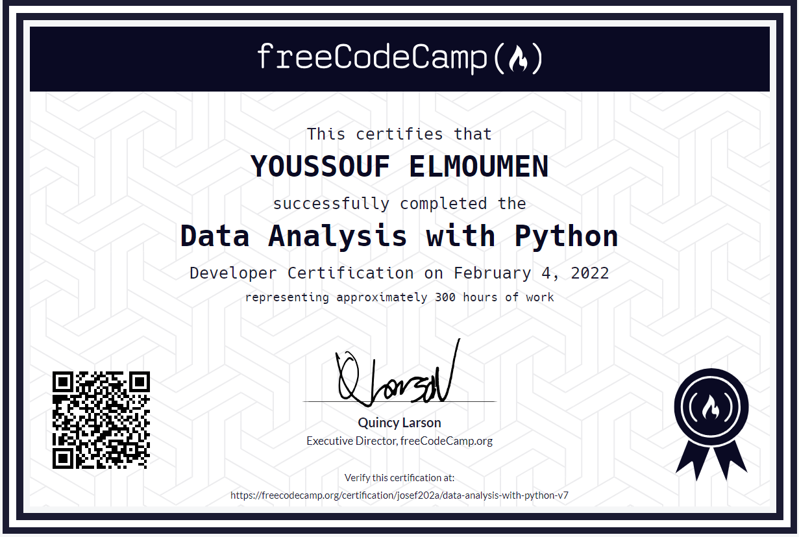

# Data Analysis with Python Certification 🐍📊

Welcome to my GitHub repository where I showcase my achievement in completing the **Data Analysis with Python Certification**. 🚀 In this certification, I've gained a solid understanding of the fundamentals of data analysis using Python and various libraries.

## Course Overview 📚

In the Data Analysis with Python Certification, I mastered the following skills:

- Reading data from diverse sources: CSVs, SQL, and Excel.
- Utilizing essential libraries such as Numpy, Pandas, Matplotlib, and Seaborn for data processing and visualization.
- Comprehensive understanding of data analysis through video courses created by Santiago Basulto.

## Projects 📊

To solidify my knowledge, I successfully completed the following projects:

1. **Mean-Variance-Standard Deviation Calculator**
2. **Demographic Data Analyzer**
3. **Medical Data Visualizer**
4. **Page View Time Series Visualizer**
5. **Sea Level Predictor**

## Certification Completion 🏆

By completing all the projects, I have earned the prestigious **Data Analysis with Python Certification**. This certification signifies my ability to perform data analysis tasks with confidence and expertise.

## Repository Structure 📂

- `code/`: Contains the Python code for the certification projects.
- `data/`: Includes sample datasets used in the projects.
- `certification/`: Holds a copy of the certification as an image file.
- `notebooks/`: Jupyter notebooks for additional practice and exploration.

## Quick Links 🚀

- [Project 1: Mean-Variance-Standard Deviation Calculator](https://replit.com/@you202a/Mean-Variance-Standard-Deviation-Calculator?v=1)
- [Project 2: Demographic Data Analyzer](https://replit.com/@you202a/boilerplate-demographic-data-analyzer?v=1)
- [Project 3: Medical Data Visualizer](https://replit.com/@you202a/boilerplate-medical-data-visualizer?v=1)
- [Project 4: Page View Time Series Visualizer](https://replit.com/@you202a/boilerplate-page-view-time-series-visualizer?v=1)
- [Project 5: Sea Level Predictor](https://replit.com/@you202a/boilerplate-sea-level-predictor?v=1)

Feel free to explore the code, projects, and share your feedback. Happy coding! 🚀
